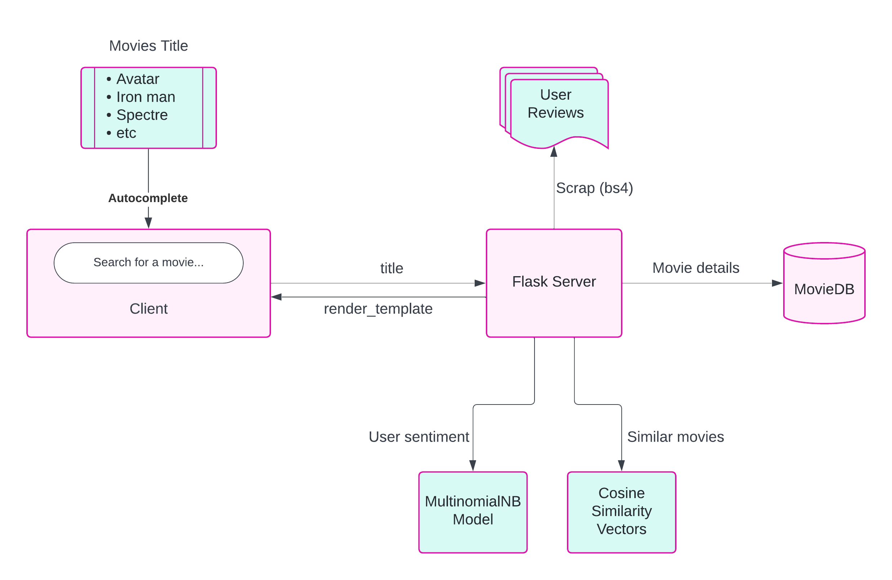

# Movie Recommendation System

This project implements a movie recommendation system using data from The Movie Database (TMDb) API. The system allows users to search for movies, view movie details, get similar movie recommendations, and explore cast details.

## Features

- **Search Movies:** Users can search for movies by title.
- **Autocompletion:** Auto suggest films title based on user input.
- **View Movie Details:** Detailed information about each movie, including posters, overview, ratings, genres, release date, and runtime, is displayed.
- **Similar Movie Recommendations:** Based on the selected movie, users can get recommendations for similar movies.
- **Explore Cast Details:** Users can explore details about the cast of a movie, including their birthdays, biographies, and place of birth.

## Architecture

## Technologies Used

- **Frontend:** HTML, CSS, JavaScript, jQuery, Bootstrap
- **Backend:** Python, Flask framework
- **API:** The Movie Database (TMDb) API

## Setup Instructions

1. Clone the repository: `git clone https://github.com/KumaarBalbir/FilmFlow.git`
2. Create a virtual environment using Conda: `conda create --name filmflow-venv python=3.8`
3. Activate the virtual environment: `conda activate filmflow-venv`
4. Install the required dependencies: `pip install -r requirements.txt`
5. Run the Flask application: `python main.py`
6. Open the browser and navigate to `http://localhost:5000` to access the application.

## Project Structure

- `main.py`: Main Flask application file containing route definitions and API integrations.
- `static/`: Contains static files such as CSS stylesheets and JavaScript scripts (`recommend.js`: JavaScript file for frontend functionality such as **AJAX requests** and event handling and `autocomplete.js` is for **autosuggestion** while user enters title name).
- `templates/`: Contains HTML templates for pages of the application.
- `artifact`: `transform.pkl` contains a serialized version of the **TF-IDF vectorizer** or text transformer used for  text preprocessing and `sentiment-model.pkl` is serialized trained model for sentiment analysis, specifically a **Multinomial Naive Bayes** classifier.
- `preprocess`: Contains python scripts for data extraction and preprocessing of the movies details used in this project.
- `sentiment-model`: Contains script for training multinomial naive bayes model used for viewers sentiments.
- `assets`: Some project related resource.
- `requirements.txt`: List of Python dependencies required for the project.

## Usage

1. Enter the title of a movie in the search box and click on search icon.
2. Select a movie from the search results to view its details.
3. Explore similar movie recommendations and cast details.
4. Enjoy exploring and discovering new movies!

🙂 Feel free to contribute, provide feedback, or suggest improvements to the project!

